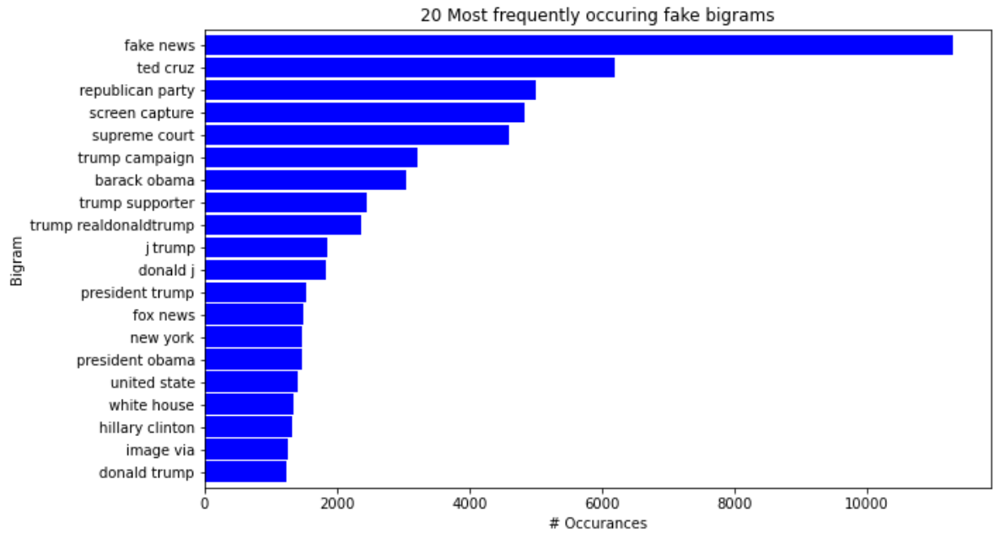
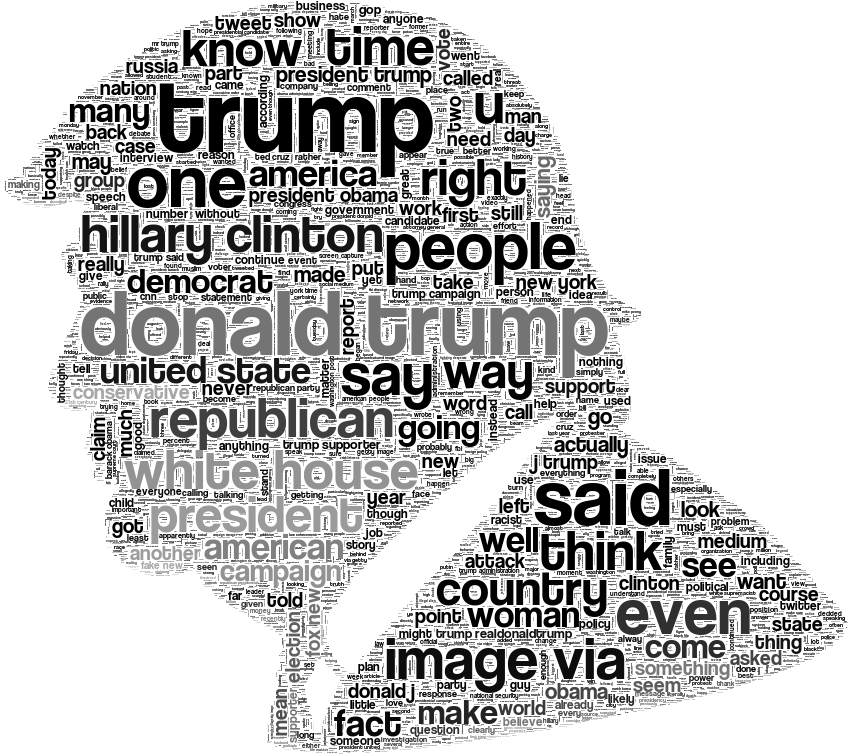
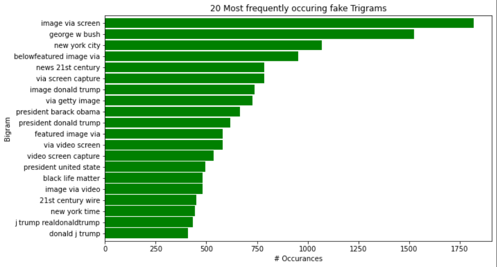
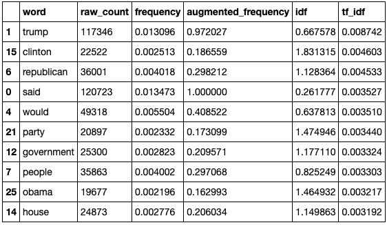

# Fake News Capstone

What is our goal?
- Our team seeks to differentiate fake news from real news through the exploration and analysis of keywords and phrases of random news articles. We will utilize NLP tools and build a classification model in hopes to shed light on purposely misleading information.

- Fake News Detector Web App: https://tinyurl.com/easely-fake-news-detector

#  Fake News Capstone - README.md

***
[[Project Description](#project_description)]
[[Project Setup](#setup)]
[[Project Planning](#planning)]
[[Key Findings](#findings)]
[[Data Dictionary](#dictionary)]
[[Acquire & Prep](#acquire_and_prep)]
[[Data Exploration](#explore)]
[[Statistical Analysis](#stats)]
[[Modeling](#model)]
[[Conclusion](#conclusion)]
___
​
## Project Description:
[[Back to top](#top)]

  
Click to expand!

### Description
- Within this project we will be using the fake news dataset acquired from the Kaggle database.
- We will clean the data through tokenizing, lemmatizing, vectorizing, and removing stop words.
- Then we will explore the data through bigrams and trigrams, while also generating word clouds. 
- Lastly we will make a model that can accurately identify fake news articles.

### Goals
- Create a classification model that can accurately identify fake news and real news articles while utilizing NLP tools like NLTK, Sentiment Analysis, and TF-IDF Vectorizer in addition to the standard data science tools.
- Our secondary goal is to create a public web application that can be used to identify fake news.
- After acquiring our MVP, we would like to create a deep learning model.

### Where did you get the data?
- We acquired the data from the Kaggle online database.

### Data Contents:
- 20,826 unqiue Real articles
- 17,903 unique Fake articles
- 38,729 total unique articles
- date of when the article was posted.
- subject of article
- title of article
- text of article
- clean_title
- clean_text
- is_fake
- title_polarity
- title_subjectivity
- text_polarity
- text_subjectivity

### Link to data: 
https://www.kaggle.com/clmentbisaillon/fake-and-real-news-dataset?select=Fake.csv

## Project Setup: 
[[Back to top](#top)]

  
Click to expand!

***
    
### Dependencies:

***
 
- utilities.py
        - Follow the instructions to use the latest features
- python
- pandas
- nltk
- re
- numpy
- matplotlib.pyplot
- seaborn
- wordcloud
- PIL
- Scipy
- Sklearn

***
    
### Steps to recreate:
    
***
    - Clone this repository
    - Install utilities.py according to the instructions
    Setup env.py
    - Follow the instructions in the notebook for acquiring the data from GitHub if it's the first time running the notebook

***
    

## Project Planning: 
[[Back to top](#top)]
    

  
Click to expand!

### Projet Outline:
    
- Acquisition of data through Kaggles online database.

- Prepare and clean data with python/NLP tools - Jupyter Labs
    - Tokenize
    - Lemmatize
    - Remove stop words
    - Vectorize

- Explore data
    - Identify top 10 words in fake news and real news articales.
    - Compare the proportion of words that show up in fake news vs real news.
    - Generate bigrams and trigrams to visualize two to three word sequences and their relationships to fake or real news.
    - Generate single word, bigram, trigram, word clouds to vizualize reiterations for specific words and word sequences.
    - Calculate TF, IDF, TF-IDF.
    - Create a final explore.py with helper fucntions

- Feature Engineering (after MVP)
    - Use sentiment anaylis to add extra features to second iteration model.
    - Add more features based on findings in exploration.

- Modeling
    - Establish baseline
    - Evaluate training data on each calssifcation model type
    - Select MVP model
    - Create final model.py with helper functions

- Presentation
    - Finalize README
    - Create story board
    - Write script
    - Create MVP presentation
    - Practice presentation
    - Record
        
### Hypothesis
- Fake news articles are more prone to be polarized and subjective.
- Text polarity for fake news is less negative than the real news news articles.
- Text subjectivity of fake news articles is less subjective than real news articles.

### Target variable
- is_fake (If the news article is fake news)

    
## Key Findings:
[[Back to top](#top)]

  
Click to expand!

### Explore:
- Findings: 

### Statistics:
- Findings: 

### Modeling:
- Findings: The most reliable model was the logistic regression model with an in sample accuracy of .99 and an out of sample accuarcy of .98.

***

## Data Dictionary  
[[Back to top](#top)]

  
Click to expand!

### Data Used
    
| Attribute | Definition | Data Type |
| ----- | ----- | ----- |
| title  |  The title of the article | string |     
| text |  The text of the article | string |    
| subject | The subject of the article | string |
| date | The date at which the article was posted | string |  
|target|
| is_fake | If the news article is fake news | boolean |
| clean_title | Cleaned text of articles | string |
| clean_text | Cleaned title of articles | string |
| title_polarity | 1 to -1 the more negative, the more polarization in the article | float |
| title_subjectivity | 0 to 1 the closer to one the more subjective the title is | float |
| text_polarity | 1 to -1 the more negative, the more polarization in the article | float |
| text_subjectivity | 0 to 1 the closer to one the more subjective the article is  | float |

## Wrangle:
[[Back to top](#top)]

  
Click to expand!

### Wrangle.py:
- Gather fake news dataset from Kaggle online database.

### Prepare Data
- To clean the data we had to:
    - Lemmatized
    - Tokenize
    - Vectorized 
    - Remove stop words
    - Remove duplicate rows
    - Remove nulls and NANs

| Function Name | Purpose |
| ----- | ----- |
| _nlp_clean_titles_and_text | This function takes in a dataframe and applies, tokenize, lemmatize, basic_clean, and removes all stop words for each csv file. |
| nlp_basic_clean |  |
| nlp_tokenize |  |
| nlp_remove_stopwords |  |
| nlp_lemmatize |  |
    
- From here we :
    - Combined the two csv files (fake.csv, real.csv)
    - Set the date to data time format
    - 

| Function Name | Purpose |
| ----- | ----- |
| _combine_csv_files | This function  |
| _determine_value_in_correct_format |  |
| _standardize_dates |  |
| _drop_empty_rows |  |
| wrangle_articles |  |

​
***
    

## Data Exploration:
[[Back to top](#top)]

  
Click to expand!

***   
    
Findings 1:

 
### Takeaways:
    -  We found that the the most common fake news words were time, one, donald, people, clinton
    
***   
    
Findings 2:

 
### Takeaways:   
    - Said and donald trump are the tope two words in the fake news related articles. 
    -     - Said and donald trump are the top two words in the fake news related articles. 
    - This could be related to some quates that were infered by the press. (id like to look into this deeper and actualy compare if these statments match what trump acutaly said)
    
***

Findings 3:

### Takeaways:   
    - The bigrams for fake news articles are filled with "in house" events and places such as supreme count, republican party, and trumps twitter tag. 

***   
    
Findings 4:

### Takeaways:   
    - The bigrams for real news are filled with phrases that represent world events and significant moments in time. 
    
***   
    
Findings 5:

### Takeaways:   
    - This visual represents the word frequency in the articles contraining the word trump (52% of all articles), and that are considered fake news.
    
***
    
Findings 6:

### Takeaways:   
    -
    
***
    
Findings 7:

### Takeaways:   
    -
 
***
    
Findings 8:

### Takeaways:   
    -

***
    
Findings 9: (Term Ferquency)

### Takeaways:   
    - 

***
    
Findings 10: (Inverse Document Frequency)

### Takeaways:   
    - 

***
    
Findings 11: (TF-IDF)

### Takeaways:   
    -
    
    
    
### Explore.py 
| Function Name | Definition |
| ------------ | ------------- |
| _show_counts_and_ratios | This fucntion takes in a dataframe and column name. Will produce a valuecounts for each label and the percetage of the data it represents |
| _percentFakevsReal | This function takes in word_counts and returns a horizontal bar plot of the proportions of Fake vs Real news for the 20 most common words |
| _wordcounts_all | This function takes in word_counts. Makes sure all words for 'fake' and 'all' are greater than 10. Generates a ratio column of fake words to all words and returns a dataframe of all the word counts and ratios for all, fake, and real words |
| _wordcount_fake | This function takes in word_counts. Makes sure all words for 'fake' and 'real' are greater than 10. Generates a ratio column of fake words to real words and returns a dataframe of all the word counts and ratios for all, fake, and real words|
| _wordcount_real | This function takes in word_counts. Makes sure all words for 'fake' and 'real' are greater than 10. Generates a ratio column of real words to fake words and returns a dataframe of all the word counts and ratios for all, fake, and real words |
| _word_clouds_rfa | This function takes in all_words, fake_words, real_words. generates a word cloud for each aurgument with a fig size of (10, 8) and titles of all_cloud, fake_cloud, real_cloud. Returns a set of word clouds for all_words, fake_words, real_words |
| _fake_bigrams | This function takes in fake_words. Generates a horizonalt bar chart with x and y labels for the top 20 fake bigrams. |
| _real_bigrams | This function takes in real_words. Generates a horizontal bar chart with x and y labels for the top 20 real bigrams.  |
| _fake_trigrams | This function takes in fake_words. Generates a horizontal bar chart with x and y labels for the top 20 fake trigrams.  |
| _real_trigrams | This function takes in real_words. Generates a horizontal bar chart with x and y labels for the top 20 real trigrams.  |

***

    

## Statistical Analysis
[[Back to top](#top)]

  
Click to expand!

### Stats
*****
- **Stat Test 1**:
*****
    - confidence_level = .95
    - a = 1 - confidence_level
   *** 
    - T-Test:
        - HO: "The mean text polarity of fake news is the not more negative than real news"
        - HA: "The mean text polarity of fake news is more negative than real news"
   *** 
    - t-stat:  3.3195
    - p-value: 0.0009
    - Result: We fail to reject the null hypothesis:  The mean text polarity of fake news is the not more negative than real news

   *** 

*****
- **Stat Test 2**:
*****
    - confidence_level = .95
    - a = 1 - confidence_level
   *** 
    - T-Test:
        - HO: "The mean text subjectivity of fake news is the not more subjective than real news"
        - HA: "The mean text subjectivity of fake news is more subjective than real news"
   *** 
    - t-stat: 74.0828
    - p-value: 0.00
    - Result: We reject the null hypothesis. We move forward with the alternative hypothesis:  The mean text subjectivity of fake news is more subjective than real news

   *** 

  

## Modeling:
[[Back to top](#top)]

  
Click to expand!

Summary of modeling choices...
        
### Models
- Will run the following models:
    - Logistic Regression
    - Decision Tree
    - Random Forest
    - K Nearest Neighbors

### Baseline Model

Mode = is_fake = False
Accuracy: .5484

### Model 1 (Logistic Regression)
    
- Training/In-Sample:
    - Accuracy: .99
    - Recall False: .99 
    - Recall True: .98
    
- Validation/Out-of-Sample 
    - Accuracy: .98
    - Recall False: .99
    - Recall True: .97
    
### Model 2 (Decision Tree)
    
- Training/In-Sample: 
    - Accuracy: .91 
    - Recall False: .94
    - Recall True: .88
    
- Validation/Out-of-Sample:
    - Accuracy: .90
    - Recall False: .93
    - Recall True: .86

### Model 3 (Random Forest)
    
- Training/In-Sample: 
    - Accuracy: .96
    - Recall False: .98
    - Recall True: .93
    
- Validation/Out-of-Sample:
    - Accuracy: .95
    - Recall False: .97
    - Recall True: .92
    
### Model 4 (K Nearest Neighbors)
    
- Training/In-Sample: 
    - Accuracy: .89
    - Recall False: .97
    - Recall True: .78
    
- Validation/Out-of-Sample:
    - Accuracy: .84
    - Recall False: .96
    - Recall True: .70

### Model.py 
| Function Name | Definition |
| ------------ | ------------- |
|  |  |

### Use Table below as a template for all Modeling results for easy comparison:

| Model | Training/In Sample Accuracy | Validation/Out of Sample Accuracy | In Sample Recall False | In Sample Recall True | Out of Sample Recall False | Out of Sample Recall True |
| ------------------- | ----| --- | --- | --- | --- | --- |
| Logistic Regression | .99 | .98 | .99 | .98 | .99 | .97 |
| Decision Tree       | .91 | .90 | .94 | .88 | .93 | .86 |
| Random Forest       | .96 | .95 | .98 | .93 | .97 | .92 |
| K Nearest Neighbors | .89 | .84 | .97 | .78 | .96 | .70 |

## Best Model:
- Logistic Regression

- Why did you choose this model?
    - This model had the overall highst accuracy of .99 in sample and .98 out of sample.
    - This mode l also had the least amount of overfitting with only a 1% decrease from in sample to out of sample tests.
    - This model also had one of the best recal scores (number of fake news articles predicted / the actual number of fake news articles)
    
## Testing the Model

- Model Test Results
     - Accuracy: .98
     - Recall False: .99
     - Recall True: .97

***

  

## Conclusion:
[[Back to top](#top)]

  
Click to expand!

    

  

>>>>>>>>>>>>>>>
